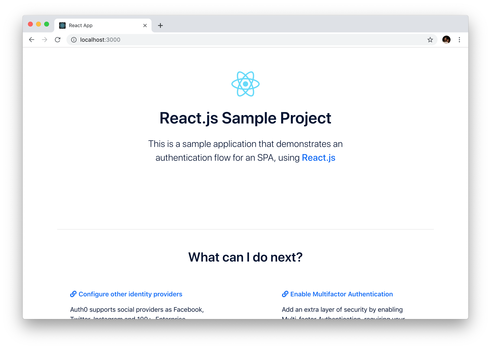
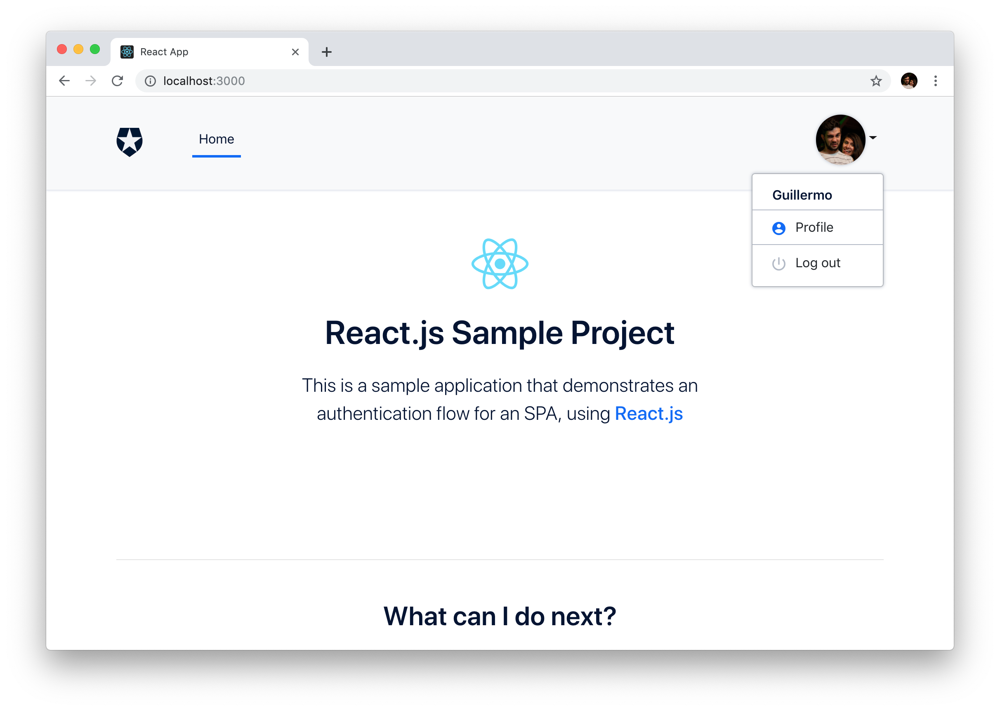
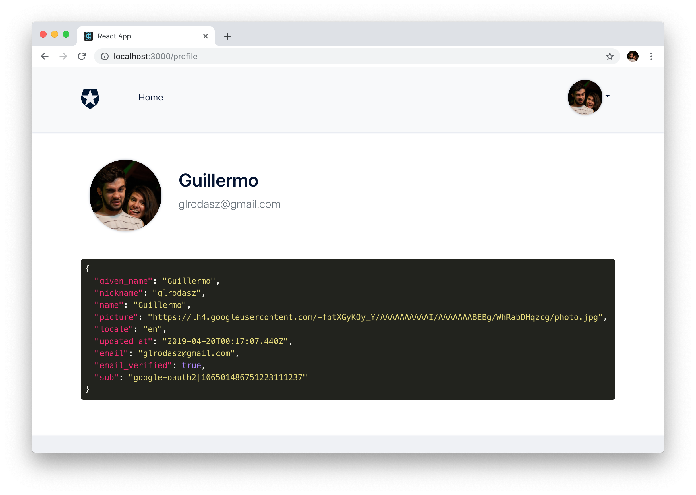

# Scenario #1 - Logging In and Gated Content

This sample demonstrates:

- Logging in to Auth0 using Redirect Mode
- Accessing profile information that has been provided in the ID token
- Gated content. The `/profile` route is not accessible without having first logged in

## Project setup

```bash
npm install
```

### Configuration

The project needs to be configured with your Auth0 domain and client ID in order for the authentication flow to work.

To do this, first copy `src/auth_config.json.example` into a new file in the same folder called `src/auth_config.json`, and replace the values with your own Auth0 application credentials:

```json
{
  "domain": "<YOUR AUTH0 DOMAIN>",
  "clientId": "<YOUR AUTH0 CLIENT ID>"
}
```

### Compiles and hot-reloads for development

```bash
npm run start
```

## Deployment

### Compiles and minifies for production

```bash
npm run build
```

### Docker build

To build and run the Docker image, run `exec.sh`, or `exec.ps1` on Windows.

### Run your tests

```bash
npm run test
```

## What is Auth0?

Auth0 helps you to:

- Add authentication with [multiple authentication sources](https://docs.auth0.com/identityproviders), either social like **Google, Facebook, Microsoft Account, LinkedIn, GitHub, Twitter, Box, Salesforce, among others**, or enterprise identity systems like **Windows Azure AD, Google Apps, Active Directory, ADFS or any SAML Identity Provider**.
- Add authentication through more traditional **[username/password databases](https://docs.auth0.com/mysql-connection-tutorial)**.
- Add support for **[linking different user accounts](https://docs.auth0.com/link-accounts)** with the same user.
- Support for generating signed [Json Web Tokens](https://docs.auth0.com/jwt) to call your APIs and **flow the user identity** securely.
- Analytics of how, when and where users are logging in.
- Pull data from other sources and add it to the user profile, through [JavaScript rules](https://docs.auth0.com/rules).

## Create a Free Auth0 Account

1. Go to [Auth0](https://auth0.com/signup) and click Sign Up.
2. Use Google, GitHub or Microsoft Account to login.

## Issue Reporting

If you have found a bug or if you have a feature request, please report them at this repository issues section. Please do not report security vulnerabilities on the public GitHub issue tracker. The [Responsible Disclosure Program](https://auth0.com/whitehat) details the procedure for disclosing security issues.

## Author

[Auth0](https://auth0.com)

## License

This project is licensed under the MIT license. See the [LICENSE](../LICENSE) file for more info.

# Tutorial
This tutorial will help you get up and running the React app using the new SDK.

## Setting Up the Application

### Installing initial dependencies
After create a new React app using `create-react-app` we still need to install some dependencies that doesn't come with the boilerplate. These dependencies will help us with things like routing, styling and font icons. But, before that we need to move the current `dependencies` to `devDependencies` this is because we will be using a server to run the built app.

```json
- "dependencies": {
+ "devDependencies": {
    "react": "^16.8.6",
    "react-dom": "^16.8.6",
    "react-scripts": "2.1.8"
  }
```

After that we can install the new dev dependencies.

```bash
npm i -D react-router-dom highlight.js reactstrap samples-bootstrap-theme \
@fortawesome/fontawesome-svg-core @fortawesome/free-solid-svg-icons @fortawesome/react-fontawesome
```
### Create the Home view and initial components
We are going to create a serie of components in order to build our initial welcome page. Create a folder called `views` and then a Compoment called `Home.js`. This component will show a welcome message and some information. 

```jsx
// src/views/Home.js
import React, { Fragment } from "react";

import Hero from "../components/Hero";
import Content from "../components/Content";

const Home = () => (
  <Fragment>
    <Hero />
    <hr />
    <Content />
  </Fragment>
);

export default Home;
```

As you can see our `Home.js` component is build with other component pieces. Create a folder called `Compoments` and inside create two new components called `Hero.js`, and `Content.js`.

For our `Hero.js` compoment we need to move the `logo.svg` inside a folder called `assets`.

```jsx
// src/components/Hero.js
import React from "react";

import logo from "../assets/logo.svg";

const Hero = () => (
  <div className="text-center hero">
    
    <h1 className="mb-4">React.js Sample Project</h1>

    <p className="lead">
      This is a sample application that demonstrates an authentication flow for
      an SPA, using <a href="https://reactjs.org">React.js</a>
    </p>
  </div>
);

export default Hero;
```

Since we want to load the content more dinamically, we are going to create a file called `contentData.js` inside a new folder called `utils`. This data will be used inside the `Content.js` component.
```js
// utils/contentData.js
const contentData = [
  {
    title: "Configure other identity providers",
    link: "https://auth0.com/docs/connections",
    description:
      "Auth0 supports social providers as Facebook, Twitter, Instagram and 100+, Enterprise providers as Microsoft Office 365, Google Apps, Azure, and more. You can also use any OAuth2 Authorization Server."
  },
  {
    title: "Enable Multifactor Authentication",
    link: "https://auth0.com/docs/multifactor-authentication",
    description:
      "Add an extra layer of security by enabling Multi-factor Authentication, requiring your users to provide more than one piece of identifying information. Push notifications, authenticator apps, SMS, and DUO Security are supported."
  },
  {
    title: "Anomaly Detection",
    link: "https://auth0.com/docs/anomaly-detection",
    description:
      "Auth0 can detect anomalies and stop malicious attempts to access your application. Anomaly detection can alert you and your users of suspicious activity, as well as block further login attempts."
  },
  {
    title: "Learn About Rules",
    link: "https://auth0.com/docs/rules",
    description:
      "Rules are JavaScript functions that execute when a user authenticates to your application. They run once the authentication process is complete, and you can use them to customize and extend Auth0's capabilities."
  }
];

export default contentData;
```

```jsx
// src/components/Content.js
import React, { Component } from "react";

import { Row, Col } from "reactstrap";
import { FontAwesomeIcon } from "@fortawesome/react-fontawesome";

import contentData from "../utils/contentData";

class Content extends Component {
  render() {
    return (
      <div className="next-steps">
        <h2 className="mt-5 text-center">What can I do next?</h2>
          <Row className="d-flex justify-content-between">
            {contentData.map((col, i) => (
              <Col key={i} md={5}>
                <h6 className="mb-3">
                  <a href={col.link}>
                    <FontAwesomeIcon icon="link" />
                    {col.title}
                  </a>
                </h6>
                <p>{col.description}</p>
              </Col>
            ))}
          </Row>
      </div>
    );
  }
}

export default Content;

```

Another component that we need to create for our welcome page is the is the `Footer.js` component:

```jsx
// src/components/Footer.js
import React from "react";

const Footer = () => (
  <footer>
    <div className="logo" />
    <p>
      Sample project provided by <a href="https://auth0.com">Auth0</a>
    </p>
  </footer>
);

export default Footer;
```

### Editing the App component
At the moment we have created our initial components but we need to use them. For that, we need to modify our `App.js` to look like the following code.

```jsx
// src/App.js
import React, { Component, Fragment } from "react";
import { Container } from "reactstrap";

import Footer from "./components/Footer";
import Home from "./views/Home";

// styles
import "samples-bootstrap-theme/dist/css/auth0-theme.css";
import "./App.css";

// fontawesome
import initFontAwesome from "./utils/initFontAwesome";
initFontAwesome();

class App extends Component {
  render() {
    return (
      <div id="app">
        <Container className="mt-5">
          <Home/>
        </Container>
        <Footer />
      </div>
    );
  }
}

export default App;

```

We are almost ready for our first checkpoint. We need to setting up a few styles overrides, so replace the `App.css` with the following code.

```css
/* src/App.css */
.next-steps .fa-link {
  margin-right: 5px;
}

/* Fix for use only flexbox in content area */
.next-steps .row {
  margin-bottom: 0;
}

.next-steps .col-md-5 {
  margin-bottom: 3rem;
}

@media (max-width: 768px) {
  .next-steps .col-md-5 {
    margin-bottom: 0;
  }
}

.spinner {
  position: absolute;
  display: flex;
  justify-content: center;
  height: 100vh;
  width: 100vw;
  background-color: white;
  top: 0;
  bottom: 0;
  left: 0;
  right: 0;
}
```

and let's create a file called `initFontAwesome.js` inside our `utils` folder. This file will help us to initialize the Font Awesome library in React properly.

```js
/// src/utils/initFontAwesome.js
import { library } from "@fortawesome/fontawesome-svg-core";
import { faLink } from "@fortawesome/free-solid-svg-icons";

function initFontAwesome() {
  library.add(faLink);
}

export default initFontAwesome;
```

**Checkpoint 1:** At this point you can start testing how it looks so far. To start the app, run `npm run start` from the terminal to start the application.

Now go and access it at [http://localhost:3000](http://localhost:3000). You should see the welcome message and a footer.



### Create the Navbar component
Create a new component called `Navbar.js`. This component will be responsable to show the authentication controls and a dropdown that will show the profile name and the link to go to the profile page.

```jsx
// src/components/Navbar.js
import React, { Component } from "react";
import PropTypes from "prop-types";
import { NavLink as RouterNavLink } from "react-router-dom";

import {
  Collapse,
  Container,
  Navbar,
  NavbarToggler,
  NavbarBrand,
  Nav,
  NavItem,
  NavLink,
  Button,
  UncontrolledDropdown,
  DropdownToggle,
  DropdownMenu,
  DropdownItem
} from "reactstrap";

class NavBar extends Component {
  state = { isOpen: false, isAuthenticated: false, profile: {} };

  async componentDidMount() {
    const { auth0 } = this.props;

    try {
      const isAuthenticated = await auth0.isAuthenticated();
      const profile = await auth0.getUser();

      this.setState({ isAuthenticated, profile });
    } catch (error) {
      console.error(error);
    }
  }

  toggle = () => {
    this.setState({ isOpen: !this.state.isOpen });
  };

  render() {
    const { handleLoginClick, handleLogoutClick } = this.props;
    const { isAuthenticated, profile } = this.state;

    return (
      <div className="nav-container">
        <Navbar color="light" light expand="md">
          <Container>
            <NavbarBrand className="logo" />
            <NavbarToggler onClick={this.toggle} />
            <Collapse isOpen={this.state.isOpen} navbar>
              <Nav className="mr-auto" navbar>
                <NavItem>
                  <NavLink
                    tag={RouterNavLink}
                    to="/"
                    exact
                    activeClassName="router-link-exact-active"
                  >
                    Home
                  </NavLink>
                </NavItem>
              </Nav>
              <Nav className="d-none d-md-block" navbar>
                {!isAuthenticated && (
                  <NavItem>
                    <Button
                      id="qsLoginBtn"
                      color="primary"
                      className="btn-margin"
                      onClick={handleLoginClick}
                    >
                      Log in
                    </Button>
                  </NavItem>
                )}
                {isAuthenticated && (
                  <UncontrolledDropdown nav inNavbar>
                    <DropdownToggle nav caret>
                      
                    </DropdownToggle>
                    <DropdownMenu right>
                      <DropdownItem header>{profile.name}</DropdownItem>
                      <DropdownItem
                        tag={RouterNavLink}
                        to="/profile"
                        className="dropdown-profile"
                        activeClassName="router-link-exact-active"
                      >
                        <span className="icon icon-profile" /> Profile
                      </DropdownItem>
                      <DropdownItem
                        id="qsLogoutBtn"
                        onClick={handleLogoutClick}
                      >
                        <span className="icon icon-power" /> Log out
                      </DropdownItem>
                    </DropdownMenu>
                  </UncontrolledDropdown>
                )}
              </Nav>
              {!isAuthenticated && (
                <Nav className="d-md-none" navbar>
                  <NavItem>
                    <Button
                      id="qsLoginBtn"
                      color="primary"
                      block
                      onClick={handleLoginClick}
                    >
                      Log in
                    </Button>
                  </NavItem>
                </Nav>
              )}
              {isAuthenticated && (
                <Nav className="d-md-none" navbar>
                  <NavItem>
                    <span className="user-info">
                      
                      <h6 className="d-inline-block">{profile.name}</h6>
                    </span>
                  </NavItem>
                  <NavItem>
                    <span className="icon icon-profile" />
                    <RouterNavLink to="/profile" activeClassName="router-link-exact-active">
                      Profile
                    </RouterNavLink>
                  </NavItem>
                  <NavItem>
                    <span className="icon icon-power" />
                    <RouterNavLink id="qsLogoutBtn" onClick={handleLogoutClick}>
                      Log out
                    </RouterNavLink>
                  </NavItem>
                </Nav>
              )}
            </Collapse>
          </Container>
        </Navbar>
      </div>
    );
  }
}

NavBar.propTypes = {
  auth0: PropTypes.object.isRequired,
  handleLoginClick: PropTypes.func.isRequired,
  handleLogoutClick: PropTypes.func.isRequired
};

export default NavBar;
```

As you noticed we started to using the new SPA SDK to check if the user is authenticated and then to get the profile data. An important aspect with this new SPA DK is that works asynchronously. We need to prepend the keyworkd `async` in the `componentDidMount` lifecyle method in order to work with asynchronous code. Then, use the keywork `await` to retrieve the data of the asynchrouns methods and put that data in component local state so it will render. Looks simple, right? However, we need to setting up the proper initialization of the SDK. Meanwhile, we are going to infer that this component receives a proper SDK instance.

### Reference the SDK

This article is based on the new SPA SDK available [here](https://github.com/auth0/auth0-spa-js). So we can install it using npm.

```bash
npm i -D @auth0/auth0-spa-js
```

> **Note** this uses the version `0.0.1-alpha.18`. You might need to change this to a newer one when available.

### Setup

Let's go to the `App.js` compoment and import the new SPA SDK, and the create an empty configuration file, then import it as well (We will see how to fill it later).

```js
// src/App.js

// auth0 spa sdk
import createAuth0Client from "@auth0/auth0-spa-js";

// auth0 config
import config from "./auth_config";
```

To initialize the new SPA SDK, we are going to do it in the `componentDidMount` lifecycle method in an `asycn` way. Also, we need to initialize our component local state.

```js
// src/App.js
state = { loading: true, auth0: null };

async componentDidMount() {
  try {
    const auth0 = await createAuth0Client({
      domain: config.domain,
      client_id: config.clientId
    });

    this.setState({ loading: false, auth0 });
  } catch (error) {
    console.error(error);
  }
}
```

Let's add the login a logout methods in our `App.js` as well.

```js
// src/App.js
handleLoginClick = async () => {

};

handleLogoutClick = async event => {

};
```

Finally let's create a `Loading.js` component to show it while our SDK is ready to use in the render method of our `App.js` component. Please, don't forget to copy the `loading.svg` into the assets folder.

```js
// src/components/Loading.js
import React from "react";
import loading from "../assets/loading.svg";

const Loading = () => (
  <div className="spinner">
    
  </div>
);

export default Loading;
```

If the loading state is true we will show the `Loading.js` component, if not we will show our `Home.js` but now we want to include the `Navbar.js` component and pass our `auth0` instance from the local state, including the login and logout methods that we defined before.

```js
// src/App.js
import Loading from "./components/Loading";

render() {
  const { loading, auth0 } = this.state;

  if (loading) {
    return <Loading />;
  }

  return (
    <div id="app">
      <Container className="mt-5">
        <NavBar
          auth0={auth0}
          handleLoginClick={this.handleLoginClick}
          handleLogoutClick={this.handleLogoutClick}
        />
        <Home />
      </Container>
      <Footer />
    </div>
  )
}
```

The final `App.js` should look like this.
```jsx
// src/App.js
import React, { Component, Fragment } from "react";
import { Container } from "reactstrap";
import createAuth0Client from "@auth0/auth0-spa-js";

import Loading from "./components/Loading";
import NavBar from './components/NavBar';
import Footer from "./components/Footer";
import Home from "./views/Home";

// auth0 config
import config from "./auth_config";

// styles
import "samples-bootstrap-theme/dist/css/auth0-theme.css";
import "./App.css";

// fontawesome
import initFontAwesome from "./utils/initFontAwesome";
initFontAwesome();

class App extends Component {
  state = { loading: true, auth0: null };

  async componentDidMount() {
    try {
      const auth0 = await createAuth0Client({
        domain: config.domain,
        client_id: config.clientId
      });

      this.setState({ loading: false, auth0 });
    } catch (error) {
      console.error(error);
    }
  }

  handleLoginClick = async () => {

  };

  handleLogoutClick = async event => {

  };

  render() {
    const { loading, auth0 } = this.state;

    if (loading) {
      return <Loading />;
    }

    return (
      <div id="app">
        <Container className="mt-5">
          <NavBar
            auth0={auth0}
            handleLoginClick={this.handleLoginClick}
            handleLogoutClick={this.handleLogoutClick}
          />
          <Home />
        </Container>
        <Footer />
      </div>
    );
  }
}

export default App;
```

### Auth0 dashboard

Access the [Auth0 dashboard](https://manage.auth0.com/#/applications) and go into the Applications section.


1.  Create a new Application of type "Single Page Application" by giving it a name of choice and clicking "Create". The dashboard redirects you to the quickstart which you can skip and go straight to "Settings" tab.
2.  At the top of the page are displayed the `client_id` and `domain` values. Take note of them as you will be using them later.
3.  Add `http://localhost:3000` into the "Allowed Callback URLs" box.
4.  Add `http://localhost:3000` into the "Allowed Web Origins" box.
5.  Lastly, add `http://localhost:3000` into the "Allowed Logout URLs" box.
6.  Click the `SAVE CHANGES` button to save the configuration.
7.  Go to the "Connections" tab and enable the connections you wish to use for authentication. e.g. the default "Username-Password-Authentication".


Create an `auth_config.json` in the `src` folder of the project. Place the information collected in the step (2) above in the following way:

```json
{
  "domain": "{DOMAIN}",
  "clientId": "{CLIENT_ID}"
}
```

> **Note**: As `auth_config.json` is served publicly, this file should **never** contain sensitive information such as passwords and client secrets, and it is recommend to add it into the `.gitignore`.


### Performing the authentication

Authentication is achieved through a redirect to the Auth0 [Universal Login Page](https://auth0.com/docs/hosted-pages/login). Once the user signs up or signs in, the result will be passed to the redirect URI given as part of the authentication call.

As we saw before we can start the authentication on the "Log in" button click by calling the `auth0.loginWithRedirect()` method passing a valid redirect URI. 

```js
// src/App.js

handleLoginClick = async () => {
  const { auth0 } = this.state;

  try {
    await auth0.loginWithRedirect({
      redirect_uri: `${window.location.origin}/callback`
    });
  } catch (error) {
    console.error(error);
  }
};
```

Additionally, we need to implement a `Callback.js` view so we can detect that an authentication result is present and needs to be parsed. In that scenario, we want to call the `auth0.handleRedirectCallback()` method. This will attempt to exchange the result that the Auth0 backend gave you back for real tokens you can use.

```js
// src/views/Callback.js
import React, { Component } from "react";

import Loading from "../components/Loading";

class Callback extends Component {
  async componentDidMount() {
    const { auth0, history } = this.props;

    try {
      const result = await auth0.handleRedirectCallback();
      const targetUrl = result.appState && result.appState.targetUrl;

      history.push(targetUrl || "/");
    } catch (error) {
      console.error(error);
    }
  }

  render() {
    return <Loading />;
  }
}

export default Callback;
```

Now the redirect is properly handled and the authentication can be completed successfully, but you need to refactor our `App.js` a little bit because this redirection needs to configure the router properly to handle it.

```jsx
// src/App.js
import { BrowserRouter as Router, Route, Switch } from "react-router-dom";
import Callback from "./views/Callback";

render() {
  const { loading, auth0 } = this.state;

  if (loading) {
    return <Loading />;
  }

  return (
    <div id="app">
      <Router>
        <Switch>
          <Route
            path="/callback"
            render={props => <Callback auth0={auth0} {...props} />}
          />
          <Route
            path="/"
            render={() => (
              <Fragment>
                <NavBar
                  auth0={auth0}
                  handleLoginClick={this.handleLoginClick}
                  handleLogoutClick={this.handleLogoutClick}
                />
                <Container className="mt-5">
                  <Route path="/" exact component={Home} />
                </Container>
                <Footer />
              </Fragment>
            )}
          />
        </Switch>
      </Router>
    </div>
  );
}
```

**Checkpoint 2:** Run the project and click the "Log in" button. You should be taken to the Universal Login Page configured for your application. Go ahead and create a new user or log in using a social connection. After authenticating successfully, you will be redirected to callback page. This time, the result will be present in the URL query and the exchange will happen automatically. If everything went fine, you will end up with no query parameters in the URL, the user would now be logged in and the "Log out" button will be enabled.

If at this part you see any errors on the Auth0 page, check that you have not forgotten to whitelist the callback URL or the allowed origins as explained initially.



### Logging the user out

You may have noticed that the "Log out" button is clickable when the user is authenticated, but does nothing. You need to add the code that will log the user out from the Auth0 backend.

Start the log out by calling the `auth0.logout()` method passing a valid return-to URI. In this sample you will return the user back to the same page they are now. You can obtain that value from `window.location.origin` property. Abstract this logic into a `loghandleLogoutClickout()` method.

```js
// src/App.js

handleLogoutClick = async event => {
  event && event.preventDefault();
  const { auth0 } = this.state;

  auth0.logout({ returnTo: window.location.origin });
};
```

**Checkpoint 3:** Being authenticated click the "Log out" button. Now the authentication cookies were cleared and the user is logged out. The "Log in" button will be enabled back again.

If at this part you see any errors on the Auth0 page, check that you have not forgotten to whitelist the logout url as explained initially.

### Reading the user profile

Everytime a user is logged in you get the associated **user profile** information. Typically, is used to display their name and profile picture. In this guide you are going to display in a code block using the library `highlight.js`.

Let's create a `Highlight.js` component.

```jsx
// src/components/Highlight.js
import React, { Component } from "react";
import PropTypes from "prop-types";

import hljs from "highlight.js/lib/highlight";
import "highlight.js/styles/monokai-sublime.css";

const registeredLanguages = {};

class Highlight extends Component {
  constructor(props) {
    super(props);

    this.state = { loaded: false };
    this.codeNode = React.createRef();
  }

  componentDidMount() {
    const { language } = this.props;

    if (language && !registeredLanguages[language]) {
      try {
        const newLanguage = require(`highlight.js/lib/languages/${language}`);
        hljs.registerLanguage(language, newLanguage);
        registeredLanguages[language] = true;

        this.setState({ loaded: true }, this.highlight);
      } catch (e) {
        console.error(e);
        throw Error(`Cannot register the language ${language}`);
      }
    } else {
      this.setState({ loaded: true });
    }
  }

  componentDidUpdate() {
    this.highlight();
  }

  highlight = () => {
    this.codeNode &&
      this.codeNode.current &&
      hljs.highlightBlock(this.codeNode.current);
  };

  render() {
    const { language, children } = this.props;
    const { loaded } = this.state;

    if (!loaded) {
      return null;
    }

    return (
      <pre className="rounded">
        <code ref={this.codeNode} className={language}>
          {children}
        </code>
      </pre>
    );
  }
}

Highlight.propTypes = {
  children: PropTypes.node.isRequired,
  language: PropTypes.string
};

Highlight.defaultProps = {
  language: "json"
};

export default Highlight;
```

Then, we need to create the `Profile.js` view where we will call the SPA SDK method `auth0.getUser()` in order to get the profile information for put it into the local state and render it into the `Highlight` component.

```jsx
// src/views/Profile.js
import React, { Component } from "react";
import PropTypes from "prop-types";
import { Container, Row, Col } from "reactstrap";

import Highlight from "../components/Highlight";
import Loading from "../components/Loading";

class Profile extends Component {
  state = { loading: true, profile: {} };

  async componentDidMount() {
    const { auth0 } = this.props;

    try {
      const profile = await auth0.getUser();

      this.setState({ loading: false, profile });
    } catch (error) {
      console.error(error);
    }
  }

  render() {
    const { loading, profile } = this.state;

    if (loading || !profile) {
      return <Loading />;
    }

    return (
      <Container className="mb-5">
        <Row className="align-items-center profile-header">
          <Col md={2}>
            
          </Col>
          <Col md>
            <h2>{profile.name}</h2>
            <p className="lead text-muted">{profile.email}</p>
          </Col>
        </Row>
        <Row>
          <Highlight>{JSON.stringify(profile, null, 2)}</Highlight>
        </Row>
      </Container>
    );
  }
}

Profile.propTypes = {
  auth0: PropTypes.object.isRequired
};

export default Profile;
```

Now is time to update our `App.js` in order to render the `Profile` view given the `/profile` route.

```jsx
// src/App.js
<div id="app">
  <Router>
    <Switch>
      <Route
        path="/callback"
        render={props => <Callback auth0={auth0} {...props} />}
      />
      <Route
        path="/"
        render={() => (
          <Fragment>
            <NavBar
              auth0={auth0}
              handleLoginClick={this.handleLoginClick}
              handleLogoutClick={this.handleLogoutClick}
            />
            <Container className="mt-5">
              <Route path="/" exact component={Home} />
              <Route path="/profile"  render={() => <Profile auth0={auth0} />} />
            </Container>
            <Footer />
          </Fragment>
        )}
      />
    </Switch>
  </Router>
</div>
```

**Checkpoint 4:** Go ahead and run the project one more time. Now if the user is authenticated and you navigate to the `/profile` page using the dropdown you will see its profile data. See how this content disappears when you log out.



### Creating a PrivateRoute
So far we have almost everything working in our React app. But, there is something that is not working as expected. What happens if we are not logged in and we try to go to `/profile` manually? We are going to see a perpuetual loading, since we haven't provide a way to login if is neccesary. So let's fix that, let's create a `PrivateRoute.js` component. It is called in that way because any component wrapped in this route will check if the user is authenticated before render, and if not is going to trigger the authentication flow and should return to the desired view.

First we need to create a High-Order Component function that will wrap any component to check if is authenticated and it will inject our SPA SDK. If you are not familiar with HOCs I recommend you to explore it in the [React's docs](https://reactjs.org/docs/higher-order-components.html).

```jsx
// src/hocs/withAuhtentication.js

import React, { Component } from "react";

import Loading from "../components/Loading";

function withAuthentication(WrappedComponent, auth0) {
  return class WithAuthentication extends Component {
    state = { loading: true };

    async componentDidMount() {
      const { path } = this.props;
      const isAuthenticated = await auth0.isAuthenticated();

      if (!isAuthenticated) {
        await auth0.loginWithRedirect({
          redirect_uri: `${window.location.origin}/callback`,
          appState: { targetUrl: path }
        });
      }

      this.setState({ loading: false });
    }

    render() {
      const { loading } = this.state;

      if (loading) {
        return <Loading />;
      }

      return <WrappedComponent auth0={auth0} {...this.props} />;
    }
  };
}

export default withAuthentication;
```

With the HOC in place, now we can create our `PrivateRoute.js` component an abstraction of a Route component using the HOC. This is an async version of the example given in (React Router's docs)[https://reacttraining.com/react-router/web/example/auth-workflow]

```jsx
// src/components/PrivateRoute.js

import React from "react";
import PropTypes from "prop-types";
import { Route } from "react-router-dom";

import withAuthentication from "../hocs/withAuthentication";

const PrivateRoute = ({ component: Component, path, auth0, ...rest }) => {
  const ComponentWithAuthentication = withAuthentication(Component, auth0);
  const render = props => (
    <ComponentWithAuthentication path={path} {...props} />
  );

  return <Route path={path} render={render} {...rest} />;
};

PrivateRoute.propTypes = {
  component: PropTypes.oneOfType([PropTypes.element, PropTypes.func])
    .isRequired,
  path: PropTypes.oneOfType([
    PropTypes.string,
    PropTypes.arrayOf(PropTypes.string)
  ]).isRequired,
  auth0: PropTypes.object.isRequired
};

export default PrivateRoute;
```

With the `PrivateRoute.js` component create we need to modify one last time our `App.js` component.


```jsx
// src/App.js
+ import PrivateRoute from "./components/PrivateRoute";

- <Route path="/profile"  render={() => <Profile auth0={auth0} />} />
+ <PrivateRoute path="/profile" auth0={auth0} component={Profile} />
```

**Checkpoint 5:** Run the project again. Now if the user is not authenticated and you navigate to the `/profile` you will be send though the authentication flow and will see the Profile page without issues.

## Create the server
Our frontend code is ready. But, since we are running a SPA with a routing system it is a good idea to setting up a server that handles all request to response with our SPA. You will create a basic web server using [ExpressJS](https://expressjs.com). This will be used to serve our HTML page, along with any assets that it requires (JavaScript, CSS, etc).

### Installing server dependencies
In the terminal, install the dependencies that are necessary to get the server up and running:

```bash
npm install express morgan
```

### Creating server.js
Next, create a new file in the root called `server.js`. This will be our backend server and will be used to serve the SPA pages. Populate it with the following:

```js
// server.js

/* eslint-disable no-console */
const express = require("express");
const { join } = require("path");
const morgan = require("morgan");
const app = express();

app.use(morgan("dev"));
app.use(express.static(join(__dirname, "build")));

app.use((_, res) => {
  res.sendFile(join(__dirname, "build", "index.html"));
});

app.listen(3000, () => console.log("Listening on port 3000"));
```

The server provides one enpoint which serves every other request to the `index.html` file, which will provide support for any client-side routing as all routes go to the same page. The app also serves all of the static files, such as the `.js` and `.css` files from the `/public` folder.

**Checkpoint 6:** If you want to run the project using the server, you need to build the app running `npm run build` and then run the server with `node server.js`. Everything should work as before but much faster because we are serving production code.