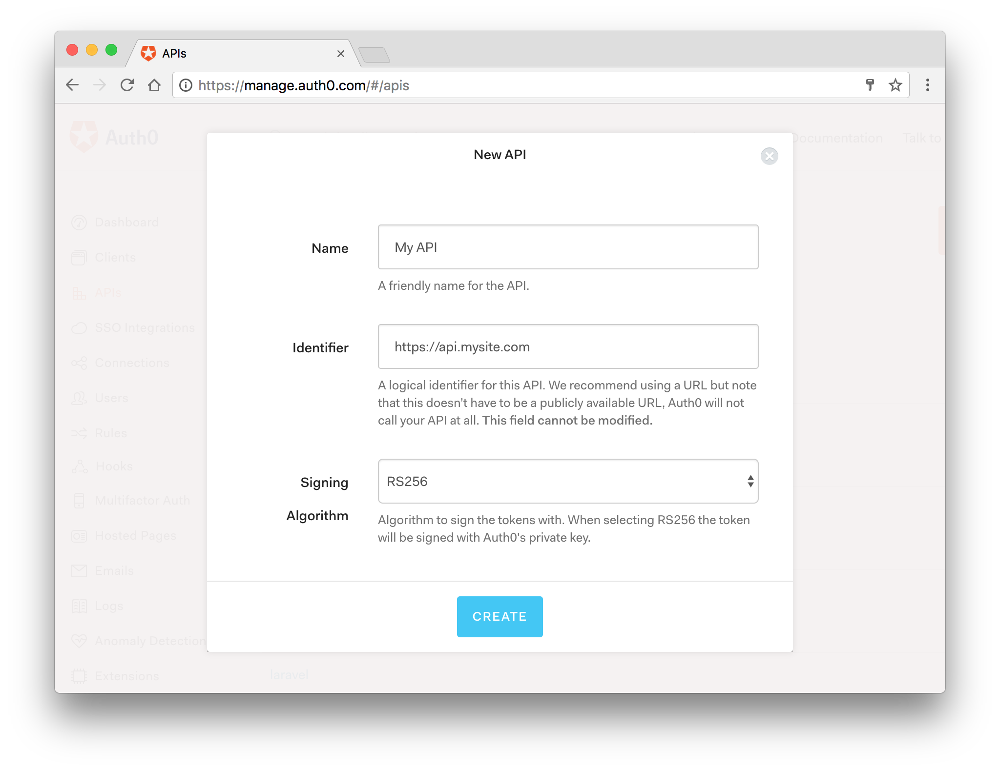

# Tutorial

_This tutorial demonstrates how to make API calls for protected resources on your server._

Most single page applications use resources from data APIs. You may want to restrict access to those resources, so that only authenticated users with sufficient privileges can access them. Auth0 lets you manage access to these resources using [API Authorization](/api-auth).

This tutorial shows you how to create a simple API using [Express](https://expressjs.com) that validates incoming JSON Web Tokens. You will then see how to call this API using an Access Token granted by the Auth0 authorization server.

## Create an API

In the [APIs section](https://manage.auth0.com/#/apis) of the Auth0 dashboard, click **Create API**. Provide a name and an identifier for your API.
You will use the identifier later when you're configuring your Javascript Auth0 application instance.
For **Signing Algorithm**, select **RS256**.



## Create the Backend API

For this example, you'll create an [Express](https://expressjs.com/) server that acts as the backend API. This API will expose an endpoint to validate incoming [JWT-formatted access tokens](https://auth0.com/docs/tokens/concepts/jwts) before returning a response.

Start by installing the following packages:

```bash
npm install cors express express-jwt jwks-rsa npm-run-all
```

- [`express`](https://github.com/expressjs/express) - a lightweight web server for Node
- [`express-jwt`](https://www.npmjs.com/package/express-jwt) - middleware to validate JsonWebTokens
- [`cors`](https://github.com/expressjs/cors) - middleware to enable CORS
- [`jwks-rsa`](https://www.npmjs.com/package/jwks-rsa) - retrieves RSA signing keys from a JWKS endpoint
- [`npm-run-all`](https://www.npmjs.com/package/npm-run-all) - a helper to run the SPA and backend API concurrently

Next, create a new file `server.js` with the following code:

```js
const express = require("express");
const cors = require("cors");
const jwt = require("express-jwt");
const jwksRsa = require("jwks-rsa");

// Create a new Express app
const app = express();

// Accept cross-origin requests from the frontend app
app.use(cors({ origin: "http://localhost:3000" }));

// Set up Auth0 configuration
const authConfig = {
  domain: "YOUR AUTH0 DOMAIN",
  audience: "YOUR API IDENTIFIER",
};

// Define middleware that validates incoming bearer tokens
// using JWKS from ${account.namespace}
const checkJwt = jwt({
  secret: jwksRsa.expressJwtSecret({
    cache: true,
    rateLimit: true,
    jwksRequestsPerMinute: 5,
    jwksUri: `https://${authConfig.domain}/.well-known/jwks.json`,
  }),

  audience: authConfig.audience,
  issuer: `https://${authConfig.domain}/`,
  algorithm: ["RS256"],
});

// Define an endpoint that must be called with an access token
app.get("/api/external", checkJwt, (req, res) => {
  res.send({
    msg: "Your Access Token was successfully validated!",
  });
});

// Start the app
app.listen(3001, () => console.log("API listening on 3001"));
```

The above API has one available endpoint, `/api/external`, that returns a JSON response to the caller. This endpoint uses the `checkJwt` middleware to validate the supplied bearer token using your tenant's [JSON Web Key Set](https://auth0.com/docs/jwks). If the token is valid, the request is allowed to continue. Otherwise, the server returns a 401 Unauthorized response.

Finally, modify `package.json` to add two new scripts `dev` and `server` that can be used to start the frontend and the backend API together:

```json
scripts": {
  "start": "react-scripts start",
  "build": "react-scripts build",
  "test": "react-scripts test",
  "eject": "react-scripts eject",
  "dev": "npm-run-all --parallel start server",
  "server": "node server.js"
},
```

## Specify the API Audience

For calls to the API to work properly and for access tokens to be correctly validated, the frontend application must specify the correct API audience when authenticating with Auth0. In this scenario, the application should be configured with the API identifier value (the audience) that was created earlier when the API was created in the Auth0 dashboard.

To specify the audience, open `src/auth_config.json` and add a new key called `audience` with the API identifier created earlier as the value:

```json
{
  "domain": "YOUR AUTH0 DOMAIN",
  "clientId": "YOUR AUTH0 CLIENT ID",
  "audience": "YOUR API IDENTIFIER"
}
```

Next, open `src/index.js` where the `Auth0Provider` component is initialized and specify the audience value from the configuration in the `audience` prop:

```jsx
ReactDOM.render(
  <Auth0Provider
    domain={config.domain}
    client_id={config.clientId}
    redirect_uri={window.location.origin}
    audience={config.audience} // NEW - specify the audience value
    onRedirectCallback={onRedirectCallback}
  >
    <App />
  </Auth0Provider>,
  document.getElementById("root")
);
```

With these changes, access tokens generated by Auth0 will now have the correct audience value and can be validated properly by the backend API.

## Call the API

To provide a mechanism for calling the API, create a new component called `ExternalApi.js` in the `views` directory and populate it with the following content:

```jsx
// src/views/ExternalApi.js

import React, { useState } from "react";
import { useAuth0 } from "../react-auth0-spa";

const ExternalApi = () => {
  const [showResult, setShowResult] = useState(false);
  const [apiMessage, setApiMessage] = useState("");
  const { getTokenSilently } = useAuth0();

  const callApi = async () => {
    try {
      const token = await getTokenSilently();

      const response = await fetch("http://localhost:3001/api/external", {
        headers: {
          Authorization: `Bearer ${token}`,
        },
      });

      const responseData = await response.json();

      setShowResult(true);
      setApiMessage(responseData);
    } catch (error) {
      console.error(error);
    }
  };

  return (
    <>
      <h1>External API</h1>
      <button onClick={callApi}>Ping API</button>
      {showResult && <code>{JSON.stringify(apiMessage, null, 2)}</code>}
    </>
  );
};

export default ExternalApi;
```

This component shows a button on the UI that allows the user to call the backend API. When clicked, the token is fetched from the Auth0 SDK client using `getTokenSilently()`. Notice that this function returns a `Promise` and is asynchronous. This function attempts to return the current access token. If the token is invalid, the token is refreshed silently before being returned from the function.

Once the token has been retrieved, it is used in a call using `fetch` as the bearer token in the Authorization header. The backend API will then validate this token and return either a `401 Unauthorized` response, or a `200` response with a JSON message. In this case, if a successful JSON message is received then it is displayed on the screen for the user.

To allow the user to get to this new page, modify the routing in the `App.js` file by adding a new `PrivateRoute` component to the route markup. This means that the user will not be able to get to this page without logging in.

The new route should have a `path` value of `/external-api`. The `App.js` file should look like the following after these changes are made:

```jsx
// other imports removed for brevity

// NEW - import the ExternalApi component
import ExternalApi from "./views/ExternalApi";

function App() {
  return (
    {/* other components removed for brevity */}
    <Switch>
      <Route path="/" exact />
      <PrivateRoute path="/profile" component={Profile} />

      {/* NEW - add a route to the ExternalApi component */}
      <PrivateRoute path="/external-api" component={ExternalApi} />
    </Switch>
  );
}

export default App;
```

Finally, update the navigation so that the user can click on a link to get to this new page:

```jsx
// src/components/NavBar.js

// code omitted for brevity

{
  isAuthenticated && (
    <span>
      <Link to="/">Home</Link>&nbsp;
      <Link to="/profile">Profile</Link>&nbsp;
      {/* NEW - Add a link to the /external-api route */}
      <Link to="/external-api">External API</Link>
    </span>
  );
}
```

Now run the application again. The user should be able to click on the **External API** link to visit the new page, and click on the **Ping API** button to invoke a call to the backend API. If the call is successful, the response JSON should be visible on the page.

Now log out, and try to access the `/external-api` page through the URL without being logged in. You should be prompted to log in.
