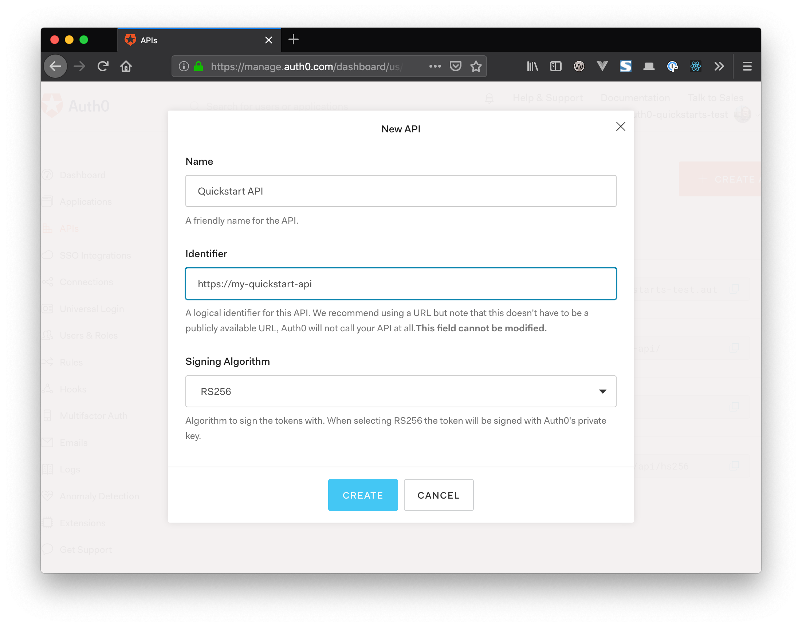

# Scenario #3 - Calling an External API

For this scenario, an API endpoint `/api/external` has been included in the Express server that requires a bearer token to be supplied as a bearer token in the `Authorization` header (as provided during the authentication flow). This uses the [`express-jwt`](https://github.com/auth0/express-jwt) middleware to validate the token against the identifier of your API as set up in the Auth0 dashboard, as well as checking that the signature is valid.

## Project setup

Use `yarn` or `npm` to install the project dependencies:

```bash
# Using npm..
npm install

# Using yarn..
yarn install
```

### Configuration

The project needs to be configured with your Auth0 domain and client ID in order for the authentication flow to work.

To do this, first copy `src/auth_config.json.example` into a new file in the same folder called `src/auth_config.json`, and replace the values with your own Auth0 application credentials:

```json
{
  "domain": "{YOUR AUTH0 DOMAIN}",
  "clientId": "{YOUR AUTH0 CLIENT ID}",
  "audience": "{YOUR AUTH0 API_IDENTIFIER}"
}
```

### Compiles and hot-reloads for development

This compiles and serves the React app, and starts the backend API server on port 3001. Calls to `http://localhost:3000/api/*` routes will be proxied through to the backend:

```bash
npm run dev
```

## Deployment

### Compiles and minifies for production

```bash
npm run build
```

### Docker build

To build and run the Docker image, run `exec.sh`, or `exec.ps1` on Windows.

### Run your tests

```bash
npm run test
```

# Tutorial: Calling an API Using Access Tokens

Most single-page apps use resources from data APIs. You may want to restrict access to those resources, so that only authenticated users with sufficient privileges can access them. Auth0 lets you manage access to these resources using [API Authorization](/api-auth).

This tutorial shows you how to create a simple API using [Express](https://expressjs.com) that validates incoming JSON Web Tokens (JWTs). You will then see how to call this API using an Access Token granted by the Auth0 authorization server.

## Create an API

In the [APIs section](${manage_url}/#/apis) of the Auth0 dashboard, click **Create API**. Provide a name and an identifier for your API. You will use the identifier later as the `audience` value when configuring your Javascript Auth0 application instance.

For **Signing Algorithm**, select **RS256**.



## Create the Backend API

For this example, you'll create an [Express](https://expressjs.com/) server that acts as the backend API. This API will expose an endpoint to validate incoming ID Tokens before returning a response.

Start by installing the following packages:

```bash
npm install express express-jwt jwks-rsa npm-run-all
```

- [`express`](https://github.com/expressjs/express) - a lightweight web server for Node
- [`express-jwt`](https://www.npmjs.com/package/express-jwt) - middleware to validate JsonWebTokens
- [`jwks-rsa`](https://www.npmjs.com/package/jwks-rsa) - retrieves RSA signing keys from a JWKS endpoint
- [`npm-run-all`](https://www.npmjs.com/package/npm-run-all) - a helper to run the SPA and backend API concurrently

Next, create a new file `server.js` in the root of the project with the following code:

```js
const express = require("express");
const jwt = require("express-jwt");
const jwksRsa = require("jwks-rsa");
const authConfig = require("./src/auth_config.json");

// Create a new Express app
const app = express();

// Define middleware that validates incoming bearer tokens
// using JWKS from ${account.tenant}
const checkJwt = jwt({
  secret: jwksRsa.expressJwtSecret({
    cache: true,
    rateLimit: true,
    jwksRequestsPerMinute: 5,
    jwksUri: `https://${authConfig.domain}/.well-known/jwks.json`
  }),

  audience: authConfig.audience,
  issuer: `https://${authConfig.domain}/`,
  algorithm: ["RS256"]
});

// Define an endpoint that must be called with an access token
app.get("/api/external", checkJwt, (req, res) => {
  res.send({
    msg: "Your Access Token was successfully validated!"
  });
});

// Start the app
app.listen(3001, () => console.log("API listening on 3001"));
```

The above API has one available endpoint, `/api/external`, that returns a JSON response to the caller. This endpoint uses the `checkJwt` middleware to validate the supplied bearer token using your tenant's [JSON Web Key Set](https://auth0.com/docs/jwks). If the token is valid, the request is allowed to continue. Otherwise, the server returns a 401 Unauthorized response.

Finally, modify `package.json` to add two new scripts `dev` and `server` that can be used to start the frontend and the backend API together:

```json
scripts": {
  "start": "react-scripts start",
  "build": "react-scripts build",
  "test": "react-scripts test",
  "eject": "react-scripts eject",
  "now-build": "react-scripts build",
  "dev": "npm-run-all --parallel start server",
  "server": "node server.js"
},
```

## Set up a proxy to the backend API

In order to call the API from the frontend application during development, the development server must be configured to proxy requests through to the backend API. To do this, open the `package.json` file in the root of the project and add a new key `proxy` with a value of `http://localhost:3001`.

Your `package.json` file should look something like the following with these changes in place (some values have been omitted for brevity):

```json
{
  "name": "auth0-react-03-calling-an-api",
  "version": "0.1.0",
  "private": true,
  "scripts": {
    "start": "react-scripts start",
    "build": "react-scripts build",
    "test": "react-scripts test",
    "eject": "react-scripts eject",
    "now-build": "react-scripts build",
    "server": "nodemon server.js",
    "dev": "npm-run-all --parallel start server"
  },
  "dependencies": { ... },
  "devDependencies": { ... },
  "eslintConfig": { ... },
  "browserslist": { ... },
  "proxy": "http://localhost:3001"
}
```

With this in place, the frontend application can make a request to `/api/external` and it will be correctly proxied through to the backend API at `http://localhost:3001/api/external`.

## Specify the API audience

For calls to the API to work properly and for access tokens to be correctly validated, the frontend application must specify the correct API audience when authenticating with Auth0. In this scenario, the application should be configured with the API identifier value (the audience) that was created ealier when the API was created in the Auth0 dashboard.

To specify the audience, open `src/auth_config.json` and add a new key called `audience` with the API identifier created earlier as the value:

```json
{
  "domain": "{YOUR AUTH0 DOMAIN}",
  "clientId": "{YOUR AUTH0 CLIENT ID}",
  "audience": "{YOUR AUTH0 API_IDENTIFIER}"
}
```

Next, open `src/index.js` where the `Auth0Provider` component is initialized and specify the audience value from the configuration in the `audience` prop:

```jsx
ReactDOM.render(
  <Auth0Provider
    domain={config.domain}
    client_id={config.clientId}
    audience={config.audience}
    onRedirectCallback={onRedirectCallback}
  >
    <App />
  </Auth0Provider>,
  document.getElementById("root")
);
```

With these changes, access tokens generated by Auth0 will now have the correct audience value and can be validated properly by the backend API.

## Calling the API

To provide a mechanism for calling the API, create a new component called `ExternalApi.js` and populate it with the following content:

```jsx
// src/components/ExternalApi.js

import React, { useState } from "react";
import { useAuth0 } from "../react-auth0-wrapper";

const ExternalApi = () => {
  const [showResult, setShowResult] = useState(false);
  const [apiMessage, setApiMessage] = useState("");
  const { getTokenSilently } = useAuth0();

  const callApi = async () => {
    try {
      const token = await getTokenSilently();

      const response = await fetch("/api/external", {
        headers: {
          Authorization: `Bearer ${token}`
        }
      });

      const responseData = await response.json();

      setShowResult(true);
      setApiMessage(responseData);
    } catch (error) {
      console.error(error);
    }
  };

  return (
    <>
      <h1>External API</h1>
      <button onClick={callApi}>Ping API</button>
      {showResult && <code>{JSON.stringify(apiMessage, null, 2)}</code>}
    </>
  );
};

export default ExternalApi;
```

This component shows a button on the UI that allows the user to call the backend API. When clicked, the token is fetched from the Aut0 SDK client using `getTokenSilently()`. Notice that this function returns a `Promise` and is asyncronous. This function attempts to return the current access token. If the token is invalid, the token is refreshed silently before being returned from the function.

Once the token has been retrieved, it is used in a call using `fetch` as the bearer token in the Authorization header. The backend API will then validate this token and return either a `401 Unauthorized` response, or a `200` response with a JSON message. In this case, if a successful JSON message is received then it is displayed on the screen for the user.

To allow the user to get to this new page, modify the routing in the `App.js` file by adding a new `PrivateRoute` component to the route markup. This means that the user will not be able to get to this page without logging in.

The new route should have a `path` value of `/external-api`. The `App.js` file should look like the following after these changes are made:

```jsx
// src/App.js

import React from "react";
import NavBar from "./components/Navbar";
import { BrowserRouter, Route, Switch } from "react-router-dom";
import PrivateRoute from "./components/PrivateRoute";
import Profile from "./components/Profile";

// NEW - import the ExternalApi component
import ExternalApi from "./components/ExternalApi";

function App() {
  return (
    <div className="App">
      <BrowserRouter>
        <header>
          <NavBar />
        </header>
        <Switch>
          <Route path="/" exact />
          <PrivateRoute path="/profile" component={Profile} />

          {/* NEW - add a route to the ExternalApi component */}
          <PrivateRoute path="/external-api" component={ExternalApi} />
        </Switch>
      </BrowserRouter>
    </div>
  );
}

export default App;
```

Finally, update the navigation so that the user can click on a link to get to this new page:

```jsx
// src/components/NavBar.js

// ... code omitted for brevity

{
  isAuthenticated && (
    <span>
      <Link to="/">Home</Link>&nbsp;
      <Link to="/profile">Profile</Link>&nbsp;
      {/* NEW - Add a link to the /external-api route */}
      <Link to="/external-api">External API</Link>
    </span>
  );
}
```

Now run the application again. The user should be able to click on the **External API** link to visit the new page, and click on the **Ping API** button to invoke a call to the backend API. If the call is successful, the response JSON should be visible on the page.

Now log out, and try to access the `/external-api` page through the URL without being logged in. You should be prompted to log in.

## What is Auth0?

Auth0 helps you to:

- Add authentication with [multiple authentication sources](https://docs.auth0.com/identityproviders), either social like **Google, Facebook, Microsoft Account, LinkedIn, GitHub, Twitter, Box, Salesforce, among others**, or enterprise identity systems like **Windows Azure AD, Google Apps, Active Directory, ADFS or any SAML Identity Provider**.
- Add authentication through more traditional **[username/password databases](https://docs.auth0.com/mysql-connection-tutorial)**.
- Add support for **[linking different user accounts](https://docs.auth0.com/link-accounts)** with the same user.
- Support for generating signed [Json Web Tokens](https://docs.auth0.com/jwt) to call your APIs and **flow the user identity** securely.
- Analytics of how, when and where users are logging in.
- Pull data from other sources and add it to the user profile, through [JavaScript rules](https://docs.auth0.com/rules).

## Create a Free Auth0 Account

1. Go to [Auth0](https://auth0.com/signup) and click Sign Up.
2. Use Google, GitHub or Microsoft Account to login.

## Issue Reporting

If you have found a bug or if you have a feature request, please report them at this repository issues section. Please do not report security vulnerabilities on the public GitHub issue tracker. The [Responsible Disclosure Program](https://auth0.com/whitehat) details the procedure for disclosing security issues.

## Author

[Auth0](https://auth0.com)

## License

This project is licensed under the MIT license. See the [LICENSE](../LICENSE) file for more info.
